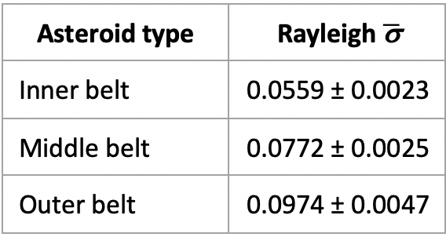
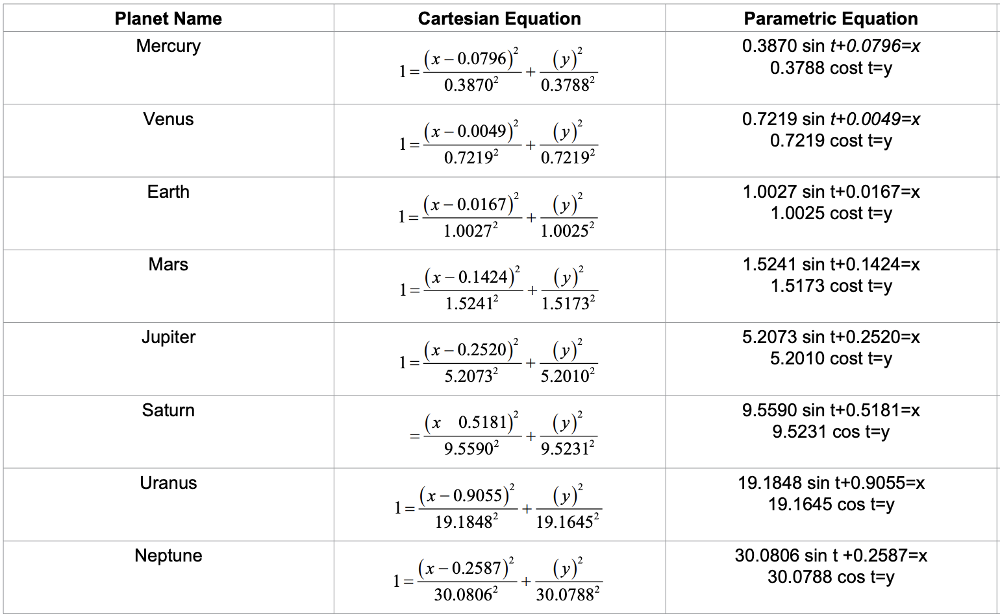

# 2D Solar System Simulation :milky_way:

Simplified 2D Solar System simulation (planets and main asteroid belt) built with JS ES6 native tools.    
There are no dependencies to install.  
To start the solar system simulation just open `SolarSystem.html` in Mozilla Firefox or Google Chrome.  

This simulation consists of two main parts: planets simulation and main asteroid belt simulation.  
To simulate the orbital movement of each asteroid in main asteroid belt, we use the following equations from [1]:    
  
  
  

According to [2] eccentricities of the asteroids in outer main asteroid belt follow Rayleigh distribution. We expanded this to inner and middle belt asteroids (values from [2]) with the following estimated parameter of distribution:  

 

To generate eccentricities of asteroids, we sample from Rayleigh distribution with sigma parameters above using conversion from uniform distribution.  

We use the following restrictions on semi-major axis of asteroids' orbits and generate them using normal distribution (samples of normal distribution are retrieved from uniformly distributed numbers using Box-Muller transform):   
  

To compute **c** (the distance between the center of the orbit and the focus of the orbit) and **b** (semi-minor axis) for each asteroid we use semi-major axis and eccentricity values via formulas below:

Planets of Solar System are moving according to parametric equations from [1]:
(all coeficients in the simulation equal the coefficients below, except increased distances for Earth and Mars to avoid collapse of Earth and Venus orbits and decreased coefficients for Uranus and Neptune for their visibility on the screen) 

  

Venus and Uranus have clockwise rotation (retrograde).
Sun, asteroids and all other planets have counter clockwise rotation.

We use uniform distribution to generate samples of Rayleigh and normal distribution as JavaScript inbuilt tool includes only uniform distribution.

### :bulb: Features:
- orbital rotation of asteroids (inner belt, middle belt, outer belt)
- orbital rotation of planets
- rotation of sun, asteroids, planets
- shadows for planets depending on position to sun
- dynamic rerendering for screen resizing 
- rotation speed is proportional to real
- AU scailed to px
- sampling from Rayleigh and normal distribution via uniform distribution
- space soundtrack with turn-on/turn-off feature

### :books: References:

1.  Ramanakumar V (2018) Mathematically Describing Planetary Orbits in Two Dimensions. J Appl Computat Math 7: 414. doi: 10.4172/2168-
9679.1000414

2. Renu Malhotra, Xianyu Wang, Eccentricity distribution in the main asteroid belt, Monthly Notices of the Royal Astronomical Society, Volume 465, Issue 4, March 2017,Pages 4381–4389, https://doi.org/10.1093/mnras/stw3009

3. Variance of the Rayleigh distribution and its relation to uniform distribution: 
https://en.wikipedia.org/wiki/Rayleigh_distribution

4. Box-Muller transformation (from uniform to normal distribution):
https://en.wikipedia.org/wiki/Box%E2%80%93Muller_transform

5. Planets info: https://nssdc.gsfc.nasa.gov/planetary/factsheet/

:notes: by Colossal Trailer Music (Gaze).

<small>Successfully tested in <b>Mozilla Firefox</b> and <b>Google Chrome</b></small>

The application is using <b>native</b> ES6 JavaScript, so you need no dependecies to install.

All planet's orbits and speeds are created in terms of real proportions.

Please, find the pictures of planets in /img directory. 

## License
